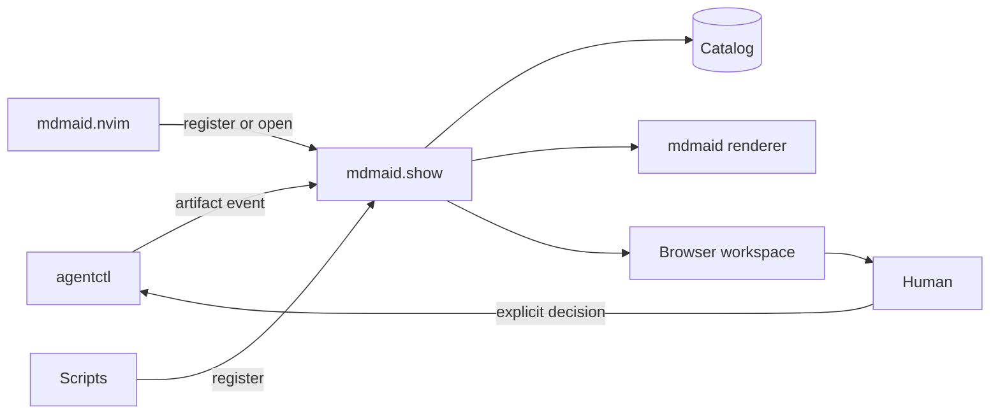

# mdmaid.show

`mdmaid.show` is a persistent local presentation workspace for Markdown
artifacts produced by CLI agents, editors, and scripts.

The repository name is `mdmaid.show`; its initial executable is
`mdmaid-show`.

## Status

The repository contains the first catalog foundation:

- persistent workspace metadata;
- Markdown document registration;
- idempotent updates by canonical path;
- workspace and artifact-root containment;
- symlink-escape protection;
- document size limits;
- atomic catalog writes with user-only permissions;
- `workspace add`, `workspace list`, `register`, and `list` commands.

The user-level daemon, directory watcher, rendering integration, stable browser
URLs, and document library UI are the next milestones.

## Responsibility

`mdmaid.show` owns:

- the persistent local daemon;
- workspace and document catalogs;
- artifact-directory discovery;
- stable document URLs;
- the browser document library;
- local CLI and API access;
- attention metadata;
- presentation security boundaries.

It does not own:

- agent workflow state;
- task approvals;
- model or provider routing;
- Markdown rendering internals;
- editor-specific keymaps.

`mdmaid` remains the rendering engine. `agentctl` emits artifact events and
approval policy. `mdmaid.nvim` may become an optional client.

## Development

```bash
npm install
npm test
```

Build:

```bash
npm run build
```

Run the CLI from the build:

```bash
node dist/cli.js --help
```

## Current CLI

Register a workspace:

```bash
node dist/cli.js workspace add /path/to/repository \
  --id example \
  --name "Example"
```

Register a document:

```bash
node dist/cli.js register /path/to/repository/docs/plan.md \
  --workspace example \
  --task PROJECT-123 \
  --kind plan \
  --attention approval
```

List documents:

```bash
node dist/cli.js list --workspace example
node dist/cli.js list --task PROJECT-123
```

The default catalog path is:

```text
${XDG_STATE_HOME:-~/.local/state}/mdmaid.show/catalog.json
```

## Target Interaction



Document registration and browser presentation never imply workflow approval.

## Documentation

- [Architecture and roadmap](docs/ARCHITECTURE.md)
- [Security policy](SECURITY.md)
- [Contributing](CONTRIBUTING.md)

## Naming

Current naming:

```text
Product/UI:  mdmaid.show
Repository:  mdmaid.show
Package:     mdmaid.show
CLI:         mdmaid-show
```

A future `mdmaid show ...` umbrella command may delegate to this package, but
the repositories and release cycles remain separate.
