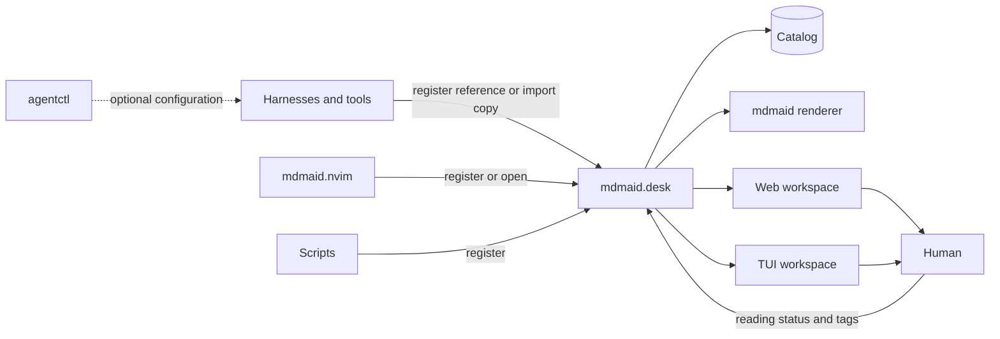

# mdmaid.desk

`mdmaid.desk` is a persistent local document inbox and reading workspace for
Markdown artifacts produced by harnesses, editors, and scripts.

The repository name is `mdmaid.desk`; its initial executable is
`mdmaid-desk`.

## Status

The repository contains the first usable shared-service vertical slice:

- persistent workspace metadata;
- Markdown document registration;
- opt-in durable imports for sources outside workspace artifact roots;
- idempotent updates by canonical path;
- workspace and artifact-root containment;
- symlink-escape protection;
- document size limits;
- revision-aware Unread, Reading, and Done state;
- tags, archive, and missing-document state;
- transactional SQLite migrations and one-time JSON catalog import;
- user-only catalog permissions;
- authenticated loopback HTTP API and stable document/workspace routes;
- sanitized `mdmaid` HTML and terminal rendering;
- responsive browser queue, project/status filters, search, reader, and actions;
- terminal-native queue, filters, search, reader, and lifecycle actions;
- Server-Sent Event refreshes for both clients;
- atomic, user-only daemon discovery state so the TUI reuses a running service;
- memorable `http://mdmaid.desk.localhost:43127/` browser origin;
- daemon-first CLI writes with daemonless SQLite fallback;
- explicit start, status, stop, login-service install, and uninstall lifecycle;
- selectable ports with automatic available-port fallback;
- `workspace`, `register`, `import`, `list`, `web`, `tui`, and `daemon`
  commands.

Directory watching, stdin import, comments, and editing remain planned
milestones. Document registration works without a daemon, but automatically
uses its authenticated API when one is running. `web` reuses a daemon or runs
the service in the foreground; `tui` attaches to it when present and uses a
session-scoped embedded loopback service otherwise.

## Responsibility

`mdmaid.desk` owns:

- the persistent catalog and optional local daemon;
- workspace and document catalogs;
- artifact-directory discovery;
- stable document URLs;
- the browser document library;
- local CLI and API access;
- attention metadata;
- presentation security boundaries.

It does not own:

- agent workflow state;
- task approvals;
- model or provider routing;
- Markdown rendering internals;
- editor-specific keymaps.

`mdmaid` remains the rendering engine. `agentctl` is a configurator only.
Harnesses and tools register documents directly through generic CLI/API
interfaces. `mdmaid.nvim` may become an optional client.

## Development

mdmaid.desk requires Node.js 22 or newer.

```bash
npm install
npm test
```

Build:

```bash
npm run build
```

Run the CLI from the build:

```bash
node dist/cli.js --help
```

## Installation

After the first public release, install the canonical npm package globally:

```bash
npm install --global mdmaid-desk
mdmaid-desk --version
mdmaid-desk web
```

In another terminal, open the same catalog through the terminal client:

```bash
mdmaid-desk tui
```

Homebrew is the planned first-class macOS installation and service path. Its
formula will consume this same npm release so the two installers share one
version and artifact lineage. See [Releasing and distribution](docs/RELEASING.md)
for the rollout and one-time npm bootstrap.

## Current CLI

Register a workspace:

```bash
node dist/cli.js workspace add /path/to/repository \
  --id example \
  --name "Example"
```

Register a document:

```bash
node dist/cli.js register /path/to/repository/docs/plan.md \
  --workspace example \
  --task PROJECT-123 \
  --producer codex \
  --kind plan \
  --attention approval \
  --tag architecture
```

Import a durable copy when the original file may disappear (for example, an
agent-run file in a temporary worktree):

```bash
mdmaid-desk import /path/to/worktree/.agent-runs/readability/adapted.md \
  --workspace example \
  --producer claude-code \
  --kind brief \
  --attention review
```

`register` keeps the document at its authorized workspace path and continues
to reflect later file changes. `import` is explicit: it accepts a regular,
non-symlink Markdown file from any local path, makes a private durable snapshot,
and queues that snapshot under the selected workspace. Removing the original
file does not remove the imported copy.

List documents:

```bash
node dist/cli.js list --workspace example
node dist/cli.js list --task PROJECT-123
```

Run the browser workspace as a foreground local service:

```bash
node dist/cli.js web
```

The command binds only to loopback on the stable port `43127` and prints an
authenticated URL such as:

```text
http://mdmaid.desk.localhost:43127/?token=...
```

No proxy, certificate, DNS, or `/etc/hosts` setup is required. After the first
authenticated open, the browser redirects to the clean URL, which can be
bookmarked. The service publishes a user-only `daemon.json` for local clients
and keeps its persistent random authentication token in a user-only
`auth-token` file, so browser sessions survive service restarts. Stop the
foreground service with `Ctrl-C`.

Use `--port` to select another loopback port. An advanced `--public-url` option
accepts HTTP or HTTPS `.localhost` origins; a direct HTTP origin must use the
same port as the service.

See [Local browser URL](docs/LOCAL_WEB.md) for details.

Run an optional background daemon once:

```bash
mdmaid-desk daemon start
mdmaid-desk daemon status
mdmaid-desk web
mdmaid-desk daemon stop
```

The default port is `43127`. If it is occupied, an unpinned daemon selects an
available loopback port; `daemon start` and `daemon status` print the actual
port and authenticated web URL. Pin one when desired:

```bash
mdmaid-desk daemon start --port 43210
```

To start mdmaid.desk automatically at login, explicitly install its user
service (LaunchAgent on macOS, systemd user service on Linux):

```bash
mdmaid-desk daemon install
# or: mdmaid-desk daemon install --port 43210
mdmaid-desk daemon uninstall
```

Registration never installs or permanently starts the daemon.

Run the terminal workspace:

```bash
node dist/cli.js tui
```

The TUI reuses the running web daemon when available, so both clients share
catalog events and reading state. Keys are shown in its footer; the main flow
uses `j`/`k`, `Enter`, `/`, `m`, `u`, `a`, `b`, and `q`.

The default state directory is:

```text
${XDG_STATE_HOME:-~/.local/state}/mdmaid.desk/
  auth-token
  catalog.sqlite3
  managed/     # private imported Markdown snapshots
  daemon.json  # present while a foreground or background service is running
  daemon.log
```

## Target Interaction



Document registration and presentation never imply workflow approval.

## Documentation

- [Architecture and roadmap](docs/ARCHITECTURE.md)
- [Releasing and distribution](docs/RELEASING.md)
- [Security policy](SECURITY.md)
- [Contributing](CONTRIBUTING.md)
- [MIT license](LICENSE)

## Naming

Current naming:

```text
Product/UI:  mdmaid.desk
Repository:  mdmaid.desk
Package:     mdmaid-desk
CLI:         mdmaid-desk
```

A future `mdmaid desk ...` umbrella command may delegate to this package, but
the repositories and release cycles remain separate.
