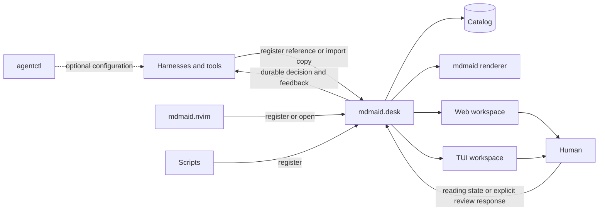

# mdmaid.desk

`mdmaid.desk` is a persistent local document inbox and reading workspace for
Markdown artifacts produced by harnesses, editors, and scripts.

The repository name is `mdmaid.desk`; its initial executable is
`mdmaid-desk`.

## Status

The repository contains the first usable shared-service vertical slice:

- persistent workspace metadata;
- Markdown document registration;
- opt-in durable imports for sources outside workspace artifact roots;
- idempotent updates by canonical path;
- workspace and artifact-root containment;
- symlink-escape protection;
- document size limits;
- revision-aware Unread, Reading, and Done state;
- tags, archive, and missing-document state;
- transactional SQLite migrations and one-time JSON catalog import;
- user-only catalog permissions;
- authenticated loopback HTTP API and stable document/workspace routes;
- registered workspace-local Markdown links rewritten to authenticated source
  viewers with line anchors;
- registered workspace-local SVG images rewritten to authenticated,
  same-origin media routes with isolated content security policy;
- sanitized `mdmaid` HTML and terminal rendering;
- responsive browser queue, project/status filters, search, reader, and actions;
- terminal-native queue, filters, search, reader, and lifecycle actions;
- Server-Sent Event refreshes for both clients;
- explicit revision-bound human review requests with durable request/response
  text and conditional web/TUI actions;
- first-class change-review documents with a dedicated terminal Changes space
  and revision-bound implementation decisions;
- atomic, user-only daemon discovery state so the TUI reuses a running service;
- memorable `http://mdmaid.desk.localhost/` browser origin;
- daemon-first CLI writes with daemonless SQLite fallback;
- explicit start, status, stop, login-service install, and uninstall lifecycle;
- stable port-80 default with explicit alternate ports for isolated testing;
- `workspace`, `validate`, `register`, `import`, `review`, `list`, `web`, `tui`,
  and `daemon` commands.

Stdin import, comments, and editing remain planned milestones. Document
registration works without a daemon, but automatically
uses its authenticated API when one is running. `web` reuses a daemon or runs
the service in the foreground; `tui` attaches to it when present and uses a
session-scoped embedded loopback service otherwise.

## Responsibility

`mdmaid.desk` owns:

- the persistent catalog and optional local daemon;
- workspace and document catalogs;
- artifact-directory discovery;
- stable document URLs;
- the browser document library;
- local CLI and API access;
- attention metadata;
- explicit local human-review requests and their durable responses;
- presentation security boundaries.

It does not own:

- agent workflow state;
- agent workflow execution or provider-session relaunch;
- model or provider routing;
- Markdown rendering internals;
- editor-specific keymaps.

`mdmaid` remains the rendering engine. `agentctl` is a configurator only.
Harnesses and tools register documents directly through generic CLI/API
interfaces. `mdmaid.nvim` may become an optional client.

## Development

mdmaid.desk requires Node.js 22 or newer.

```bash
npm install
npm test
```

Build:

```bash
npm run build
```

Run the CLI from the build:

```bash
node dist/cli.js --help
```

## Installation

After the first public release, install the canonical npm package globally:

```bash
npm install --global mdmaid-desk
mdmaid-desk --version
mdmaid-desk web
```

In another terminal, open the same catalog through the terminal client:

```bash
mdmaid-desk tui
```

Homebrew is the planned first-class macOS installation and service path. Its
formula will consume this same npm release so the two installers share one
version and artifact lineage. See [Releasing and distribution](docs/RELEASING.md)
for the rollout and one-time npm bootstrap.

## Current CLI

Register a workspace:

```bash
node dist/cli.js workspace add /path/to/repository \
  --id example \
  --name "Example worktree" \
  --repository github.com/example/example \
  --repository-name "Example"
```

Register a document:

```bash
node dist/cli.js register /path/to/repository/docs/plan.md \
  --workspace example \
  --live \
  --task PROJECT-123 \
  --feature-name "Durable Project Naming" \
  --producer codex \
  --kind plan \
  --attention approval \
  --tag architecture
```

`--repository` and `--task` form the stable logical project identity.
The producing AI supplies only the concise `--feature-name`; mdmaid.desk stores
the first accepted value and assembles the visible label as
`Repository / PROJECT-123 (Durable Project Naming)`. Documents from multiple
workspaces with the same repository/task identity appear under that one
project. Branch names are not used as display names.

Preflight every Mermaid fence without changing the catalog:

```bash
mdmaid-desk validate /path/to/repository/docs/plan.md --json
```

The command exits `0` when every diagram parses and `1` when any diagram is
invalid. Its versioned JSON report includes the total diagram count and every
issue with its block number, Markdown start line, and parser diagnostic.

Registration remains passive even when attention is `approval`. To ask for a
human decision and keep the current agent command waiting, declare the review
contract explicitly:

```bash
mdmaid-desk register /path/to/repository/docs/plan.md \
  --workspace example \
  --producer codex \
  --kind plan \
  --expect plan-decision \
  --request-message "Verify the migration and rollback strategy." \
  --wait \
  --json
```

The web and TUI show Approve, Request changes, Reject, and Mark superseded only
while that exact document revision has a pending request. The response JSON
includes both the producer's request message and the human's response text.
`changes_requested` requires explanatory text. Updating document content makes
the old request stale; opening, reading, or marking the document done never
approves it.

Review operations are also composable:

```bash
mdmaid-desk review create doc-0123456789abcdefabcd \
  --kind plan-decision \
  --message "Check rollback coverage."
mdmaid-desk review show review-0123456789abcdefabcd --json
mdmaid-desk review wait review-0123456789abcdefabcd --json
mdmaid-desk review respond review-0123456789abcdefabcd \
  --outcome changes_requested \
  --message "Add a restore verification step."
```

Import a durable copy when the original file may disappear (for example, an
agent-run file in a temporary worktree):

```bash
mdmaid-desk import /path/to/worktree/.agent-runs/readability/adapted.md \
  --workspace example \
  --producer claude-code \
  --kind brief \
  --attention review
```

`register` keeps the document at its authorized workspace path and continues
to reflect later file changes. Live-reference behavior is already the default;
`--live` is an optional explicit intent/capability marker for humans and
automation. `import` is explicit: it accepts a regular,
non-symlink Markdown file from any local path, makes a private durable snapshot,
and queues that snapshot under the selected workspace. Removing the original
file does not remove the imported copy.

Every registered-source render re-authorizes the real path and reconciles its
content hash, revision, reading state, review state, and local-link mappings.
When a foreground web service or daemon is running, mdmaid.desk also watches
the parent directories of active registered sources. A committed source
change, disappearance, or restoration publishes a document-scoped event: an
open matching Web or TUI reader rerenders automatically, while unrelated
readers only refresh queue metadata. The interfaces label registered documents
as `live source` and imports as `snapshot`.

Without a running service, registration and rendering still work and a manual
render reconciles current source state. Automatic push refresh is
daemon-dependent.

During either operation, Markdown links such as
`../../Backend/Feature.cs#L124` are resolved relative to the original Markdown
file. Targets under the registered workspace are stored as private,
workspace-relative mappings. A link to another registered reference Markdown
document opens that document's stable mdmaid.desk reader route; other local
targets use the authenticated source viewer. External `http`, `https`, and
`mailto` links are unchanged.
Linked source files remain live references rather than snapshots: each read
rechecks the workspace boundary, file type, size, and symlink policy. Re-run
`register` or `import` after upgrading an existing catalog to populate mappings
for documents that were already queued. The primary Markdown watcher does not
watch linked files; changing a linked source is visible on its next request but
does not itself refresh an open document. Local media remains limited to
validated SVG documents.

List documents:

```bash
node dist/cli.js list --workspace example
node dist/cli.js list --task PROJECT-123
```

Run the browser workspace as a foreground local service:

```bash
node dist/cli.js web
```

The command binds only to loopback on the standard HTTP port `80` and prints an
authenticated URL such as:

```text
http://mdmaid.desk.localhost/?token=...
```

No proxy, certificate, DNS, or `/etc/hosts` setup is required. After the first
authenticated open, the browser redirects to the clean URL, which can be
bookmarked. The service publishes a user-only `daemon.json` for local clients
and keeps its persistent random authentication token in a user-only
`auth-token` file, so browser sessions survive service restarts. Browser cookie
names are scoped to that token, allowing independent mdmaid.desk daemons on
different ports to remain signed in at the same time. Stop the foreground
service with `Ctrl-C`.

Use `--port` to select another loopback port for intentional isolated testing.
An advanced `--public-url` option
accepts HTTP or HTTPS `.localhost` origins; a direct HTTP origin must use the
same port as the service.

See [Local browser URL](docs/LOCAL_WEB.md) for details.

Run an optional background daemon once:

```bash
mdmaid-desk daemon start
mdmaid-desk daemon status
mdmaid-desk web
mdmaid-desk daemon stop
```

The default port is `80`. Mdmaid.desk does not silently move a daemon to a
random port when it is occupied. A default `web`, `tui`, `daemon start`, or CLI
mutation attaches to the healthy daemon recorded in the user-only descriptor.
Select a different port only when deliberately running an isolated instance:

```bash
mdmaid-desk daemon start --port 43210
```

If a healthy daemon already exists, the same-port `web` command reuses it and
a conflicting port is rejected. Stop the shared daemon before starting an
isolated instance against the same state directory.

To start mdmaid.desk automatically at login, explicitly install its user
service (LaunchAgent on macOS, systemd user service on Linux):

```bash
mdmaid-desk daemon install
# or: mdmaid-desk daemon install --port 43210
mdmaid-desk daemon uninstall
```

Agents and scripts should use the ordinary CLI commands without starting their
own server. When the installed service is healthy, the CLI reuses it; document
registration still falls back to a bounded direct catalog transaction when no
daemon is running.

Registration never installs or permanently starts the daemon.

Run the terminal workspace:

```bash
node dist/cli.js tui
```

The TUI reuses the running web daemon when available, so both clients share
catalog events and reading state. Keys are shown in its footer; the main flow
uses `j`/`k`, `Enter`, `/`, `m`, `u`, `a`, `b`, and `q`.
The queue starts grouped by project; press `g` to cycle through project, tag,
and one ordered-list view.
Pending review requests add `r` for the Actions view and `y`, `c`, or `x` for
Approve, Request changes, or Reject. The response composer uses `Enter` for a
newline, `Ctrl-D` to submit, and `Esc` to cancel.

Press `c` from the terminal queue to enter the dedicated Change Reviews space.
Producers publish an implementation review and its mandatory decision with:

```bash
mdmaid-desk register .agent-runs/change-reviews/current/review.md \
  --workspace example \
  --kind change-review \
  --attention approval \
  --expect change-decision \
  --request-message "Review this exact implementation before publication."
```

The decision is bound to the registered document revision and content hash.
Changing the review artifact makes the pending request stale.
If a separate newer review replaces an unreviewed request, mark the old request
`superseded`; this wakes a waiting producer without approving, requesting
changes, or rejecting the obsolete version.

For a native terminal diff, include one or more standard Git patches in fenced
`diff` blocks. The reader opens in Diff mode when it finds a valid patch and
provides file (`p`/`n`, with `[`/`]` aliases), line (`j`/`k`),
unified/side-by-side (`m`), and Markdown/diff (`d`) navigation. Line navigation
continues across hunk boundaries, so every displayed line can receive feedback.
Changed spans inside paired removed and added lines are emphasized. Binary and
mode-only files remain visible even when they have no text hunk.

The browser and terminal diffs also apply local, path-aware syntax colors to
common source formats. Patch text remains inert text; syntax highlighting does
not inject it as HTML or fetch a remote grammar.

Use `f` to attach feedback to the selected line, `t` to add file feedback, and
`z` to undo the most recent unsent note. In the browser, click the visible `+`
beside a line number for line feedback or use **feedback on file**. Anchored
notes become durable structured response items when
Request Changes is submitted, alongside a separate general note;
`review wait --json` returns their file paths, stable hunk IDs, optional line
and side, kinds, and messages. Open notes prevent accidental Approve, Reject,
or Supersede actions. The review surface is intentionally read-only:
staging, reverting, or editing would invalidate the frozen snapshot being
approved. Change Reviews with no native diff or with parser safety warnings
cannot be approved; the human can still Request Changes or Reject them.

Registration, import, and live-reference reconciliation validate every
Mermaid fence with Mermaid's parser. A bad diagram rejects the update with its
block number, Markdown start line, and parser diagnostic. API errors include
the same complete report under `error.validation`; `register --json` and
`import --json` preserve it so a producer can patch every reported block before
retrying. Browser rendering is also isolated per diagram so a runtime failure
remains visible without hiding the document or its stable
`/d/<document-id>` URL.

The default state directory is:

```text
${XDG_STATE_HOME:-~/.local/state}/mdmaid.desk/
  auth-token
  catalog.sqlite3
  managed/     # private imported Markdown snapshots
  daemon.json  # present while a foreground or background service is running
  daemon.log
```

## Target Interaction



Document registration and presentation never imply workflow approval.

## Documentation

- [Architecture and roadmap](docs/ARCHITECTURE.md)
- [Human review requests](docs/REVIEW_REQUESTS.md)
- [Releasing and distribution](docs/RELEASING.md)
- [Security policy](SECURITY.md)
- [Contributing](CONTRIBUTING.md)
- [MIT license](LICENSE)

## Naming

Current naming:

```text
Product/UI:  mdmaid.desk
Repository:  mdmaid.desk
Package:     mdmaid-desk
CLI:         mdmaid-desk
```

A future `mdmaid desk ...` umbrella command may delegate to this package, but
the repositories and release cycles remain separate.
