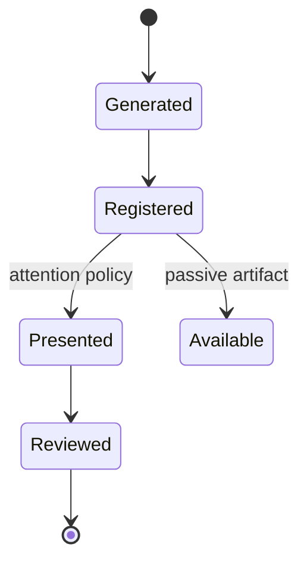

# Architecture and Roadmap

## Purpose

Mdmaid.desk turns durable Markdown files into a persistent local review
surface. Producers register artifacts; humans discover and read them in a web
or terminal workspace; external systems record any resulting decisions
separately.

## Project Boundaries

```text
mdmaid
  Markdown and Mermaid renderer

mdmaid.desk
  Daemon, catalog, watcher, stable URLs, web/TUI workspaces, CLI/API

mdmaid.nvim
  Optional Neovim client

agentctl
  Agent and harness configuration only

harnesses and tools
  Document producers using generic CLI/API or watched artifact roots
```

Mdmaid.desk must work without Neovim, agentctl, or an active agent process.

## Artifact Lifecycle



Generation, registration, presentation, and approval are separate operations.
Approval is not part of mdmaid.desk catalog state.

## Current Foundation

The catalog uses a versioned SQLite database behind a storage interface.
Workspaces authorize canonical artifact roots. Documents retain stable IDs,
content hashes, revisions, reading progress, tags, archive state, and missing
state. Reading status is derived from progress on the current revision:

```text
completedRevision == revision  -> Done
openedRevision == revision     -> Reading
otherwise                      -> Unread
```

Changing document content increments its revision and makes it Unread.
Metadata-only updates preserve progress. Existing version 1 JSON catalogs are
imported in one transaction and retained as `catalog.json.migrated`.
Markdown content remains at its authorized original path.

## Target Daemon

Use one user-level daemon with multiple workspaces:

```text
~/.local/state/mdmaid.desk/
  daemon.json
  catalog.sqlite3
  logs/
```

Target commands:

```bash
mdmaid-desk daemon ensure
mdmaid-desk daemon status
mdmaid-desk daemon stop

mdmaid-desk workspace add /path/to/repository
mdmaid-desk register plan.md
mdmaid-desk open plan.md
mdmaid-desk list --task PROJECT-123
```

`daemon ensure` is idempotent. The daemon publishes its PID, loopback host,
port, and protocol version through `daemon.json`.

The current vertical slice implements the same discovery contract through the
foreground `mdmaid-desk web` command. It atomically publishes a mode-`0600`
descriptor, and `mdmaid-desk tui` health-checks and reuses that service. The
background `ensure`, `status`, and `stop` process-management commands are the
next daemon-lifecycle step.

## Stable Routes

```text
/
/w/<workspace-id>
/t/<task-id>
/d/<document-id>
```

Each document route is independent. There is no server-global active document.
Browser tabs subscribe to updates for the document they display.

## Directory Discovery

Explicit registration provides immediate metadata. Directory watching provides
a fallback for editors and producers that do not use the API.

```text
add     validate and register
change  update revision and notify document subscribers
unlink  mark missing until reconciliation
```

Watchers are limited to configured artifact roots and Markdown files.

## Producer Integration

Any harness or tool can emit a producer-neutral registration payload:

```json
{
  "schema_version": 1,
  "producer": "codex",
  "task_id": "PROJECT-123",
  "kind": "plan",
  "path": "/absolute/path/to/plan.md",
  "attention": "approval"
}
```

The producer name is opaque metadata. Adding another harness does not require a
mdmaid.desk release. Registration and opening remain separate operations.

Suggested attention values:

```text
none
review
approval
failure
changes_requested
```

## Implementation Sequence

### 1. Catalog Foundation

Status: complete.

- workspace registration;
- document registration;
- persistence;
- path containment;
- idempotency;
- revision-aware reading progress;
- tags, filters, archive, and missing state;
- transactional SQLite schema and JSON migration;
- CLI list operations.

### 2. Daemon Lifecycle

- ensure, status, and stop commands;
- process discovery;
- protocol versioning;
- stale-state recovery;
- local mutation authentication.

### 3. Rendering and Routes

- depend on the `mdmaid` rendering package;
- render documents by stable ID;
- add workspace, task, and document routes;
- scope live reload by document.

### 4. Directory Watching

- configured artifact roots;
- add, change, and unlink reconciliation;
- ignore policy;
- watcher recovery after restart.

### 5. Web and TUI Workspaces

- task and workspace navigation;
- attention queue;
- recent documents;
- title and task search;
- missing and superseded states.

### 6. Clients

- generic harness and shell integrations;
- mdmaid.nvim daemon mode;
- generic shell integration.

## Initial Success Criteria

The first coherent release is complete when:

1. one daemon serves multiple workspaces;
2. newly created Markdown artifacts appear automatically;
3. every document has a stable URL;
4. multiple tabs display independent documents;
5. registration never implies approval;
6. the daemon cannot read outside registered artifact roots;
7. generic harnesses and mdmaid.nvim can act as clients;
8. the same reading workflow is available in web and TUI clients.
