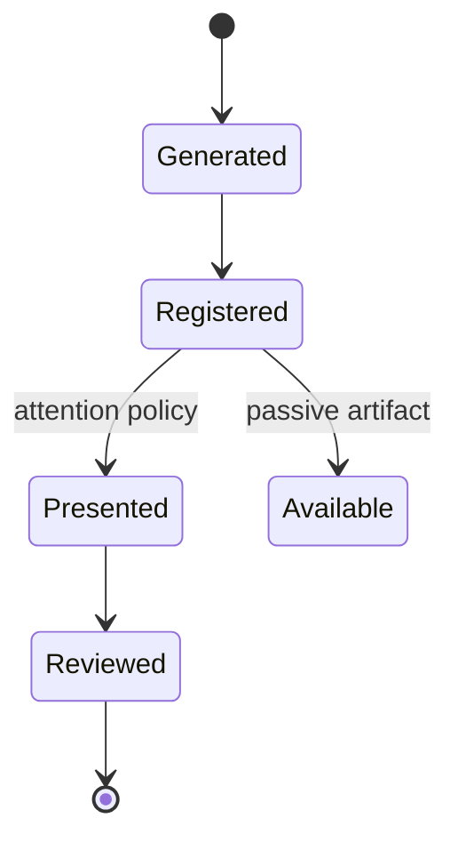

# Architecture and Roadmap

## Purpose

Mdmaid.desk turns durable Markdown files into a persistent local review
surface. Producers register artifacts; humans discover and read them in a web
or terminal workspace. When a producer explicitly creates a review request,
mdmaid.desk also persists the human decision and response text for that exact
document revision; the producer remains responsible for applying that result
to its workflow.

## Project Boundaries

```text
mdmaid
  Markdown and Mermaid renderer

mdmaid.desk
  Persistent catalog, optional daemon, watcher, stable URLs,
  web/TUI workspaces, CLI/API

mdmaid.nvim
  Optional Neovim client

agentctl
  Agent and harness configuration only

harnesses and tools
  Document producers using generic CLI/API or watched artifact roots
```

Mdmaid.desk must work without Neovim, agentctl, or an active agent process.

## Artifact Lifecycle



Generation, registration, presentation, reading, and workflow decisions are
separate operations. Registration and reading never imply approval. Explicit
review requests are stored as separate coordination records rather than fields
on the document or its reading progress.

## Current Foundation

The catalog uses a versioned SQLite database behind a storage interface.
Workspaces authorize canonical artifact roots. Documents retain stable IDs,
content hashes, revisions, reading progress, tags, archive state, missing
state, a storage mode (`reference` or `managed`), and private local-source link
mappings. Reading status is
derived from progress on the current revision:

```text
completedRevision == revision  -> Done
openedRevision == revision     -> Reading
otherwise                      -> Unread
```

Changing document content increments its revision and makes it Unread.
Metadata-only updates preserve progress. Existing version 1 JSON catalogs are
imported in one transaction and retained as `catalog.json.migrated`.
Registered Markdown remains at its authorized original path. Explicit imports
are copied atomically into mode-`0700` managed storage beside the catalog;
snapshot files are mode `0600`. The original canonical path is retained only
as private provenance. Public API responses expose the storage mode but never
the source or managed filesystem paths.

Review requests bind the document ID, revision, and private content hash at
creation. Only one request may be pending for a document. A content change or
missing source makes that request stale. Responses are immutable, exactly-once
decisions with optional text, except that requested changes require an
explanation. Request and response text are plain text and are never interpreted
as HTML, terminal control data, callback configuration, or executable commands.

Registration and import parse Markdown links on every ingress. Relative local
links are resolved from the original Markdown path, authorized against the
canonical workspace root, and persisted only as workspace-relative paths.
Rendered web links use opaque, document-scoped identifiers under
`/d/:document/source/:source`. The authenticated source viewer repeats
realpath, regular-file, symlink, size, and UTF-8 checks on every read. It does
not expose absolute paths. External HTTP(S) and mail links bypass this mapping
unchanged. Linked sources are live references; managed import snapshots only
the Markdown document, not its linked repository files.

The catalog is the durable product state. It does not depend on a running
daemon: harnesses, editors, scripts, and users can register documents through
short-lived CLI commands and view the same queue later.

## Hybrid Runtime and Optional Daemon

Use one user-level catalog with an optional single daemon:

```text
~/.local/state/mdmaid.desk/
  auth-token
  daemon.json
  catalog.sqlite3
  managed/
  logs/
```

Target commands:

```bash
mdmaid-desk daemon start
mdmaid-desk daemon status
mdmaid-desk daemon stop
mdmaid-desk daemon install
mdmaid-desk daemon uninstall

mdmaid-desk workspace add /path/to/repository
mdmaid-desk register plan.md
mdmaid-desk import /path/to/temporary/agent-output.md --workspace project-id
mdmaid-desk open plan.md
mdmaid-desk list --task PROJECT-123
```

Document ingress is daemonless by default. `workspace`, `register`, `import`,
and other short CLI mutations first health-check `daemon.json`: when a healthy
daemon exists they use its authenticated API so connected clients receive live
events; otherwise they perform a bounded catalog transaction and exit. A
producer must never need to start or install a service just to queue a
Markdown file. Registration retains the workspace-root authorization boundary.
Import is a separate opt-in operation for a durable snapshot when the original
path may disappear; it does not broaden registration or watcher authorization.

The daemon is an opt-in live coordination and presentation service. It owns
continuous behavior while active: HTTP/API access, Server-Sent Events,
directory watching, and future comment/edit coordination. It does not own the
existence of the queue. Starting or stopping it never removes catalog entries.

`daemon start` is idempotent. The daemon publishes its PID, loopback host,
port, and protocol version through `daemon.json`. `daemon install` explicitly
configures a user service for people who want an always-available browser URL;
installation or registration must not silently leave a permanent background
process running. The npm CLI installs a LaunchAgent on macOS or systemd user
service on Linux; a future Homebrew service uses the same lifecycle contract.

Both foreground `mdmaid-desk web` and the background daemon atomically publish
a mode-`0600` descriptor. CLI writes, web, and TUI health-check and reuse it.
The TUI starts a session-scoped embedded loopback server when no daemon exists.
A user can select a port, while an unpinned daemon falls back from `43127` to an
available loopback port and reports the actual value through `daemon status`.

`web` should attach to and open an existing healthy daemon when one exists. If
none exists, it starts the service in the foreground until interrupted. The
TUI follows the same attach-first policy without leaving its fallback server
running after the terminal session ends.

The foreground browser service uses the stable direct origin
`http://mdmaid.desk.localhost:43127/`. The special-use `.localhost` name maps
back to loopback, so it needs no DNS, hosts-file, proxy, or certificate setup.
Browser origin checks use that explicit origin rather than forwarding headers.
The daemon keeps a stable random mode-`0600` authentication token so browser
sessions and local API authentication survive service restarts. Its browser
cookie name includes a one-way token fingerprint, preventing another daemon on
the same hostname but a different port from overwriting the session. The
legacy unscoped cookie remains accepted during upgrades but is no longer
issued.

## Stable Routes

```text
/
/w/<workspace-id>
/t/<task-id>
/d/<document-id>
```

Each document route is independent. There is no server-global active document.
Browser tabs subscribe to updates for the document they display.

## Directory Discovery

Explicit registration provides immediate metadata. Directory watching provides
a fallback for editors and producers that do not use the API.

```text
add     validate and register
change  update revision and notify document subscribers
unlink  mark missing until reconciliation
```

Watchers are limited to configured artifact roots and Markdown files.

## Producer Integration

Any harness or tool can emit a producer-neutral registration payload:

```json
{
  "schema_version": 1,
  "producer": "codex",
  "task_id": "PROJECT-123",
  "kind": "plan",
  "path": "/absolute/path/to/plan.md",
  "attention": "approval"
}
```

The producer name is opaque metadata. Adding another harness does not require a
mdmaid.desk release. Registration, import, opening, and workflow approval
remain separate operations.

Suggested attention values:

```text
none
review
approval
failure
changes_requested
```

Attention remains presentation metadata. It does not create buttons or a
workflow gate. A producer that expects a decision creates an explicit review
request after registration:

```json
{
  "documentId": "doc-0123456789abcdefabcd",
  "documentRevision": 4,
  "kind": "plan-decision",
  "requestMessage": "Verify the migration and rollback strategy."
}
```

Web and TUI controls appear only while this request is pending. A producer may
block on `mdmaid-desk review wait`; SSE is only a wake signal, while SQLite is
the durable source of truth. A daemon restart reconnects the wait. If the
producer process itself exits, the response remains recoverable, but
mdmaid.desk does not relaunch that process.

## Implementation Sequence

### 1. Catalog Foundation

Status: complete.

- workspace registration;
- document registration;
- explicit managed document import;
- persistence;
- path containment;
- idempotency;
- revision-aware reading progress;
- tags, filters, archive, and missing state;
- transactional SQLite schema and JSON migration;
- CLI list operations.

### 2. Daemon Lifecycle

- attach-first CLI transport with direct-catalog fallback;
- start, status, and stop commands;
- explicit install and uninstall of a user service;
- process discovery;
- single-instance startup coordination;
- protocol versioning;
- stale-state recovery;
- local mutation authentication.

### 3. Rendering and Routes

- depend on the `mdmaid` rendering package;
- render documents by stable ID;
- add workspace, task, and document routes;
- scope live reload by document.

### 4. Directory Watching

- configured artifact roots;
- add, change, and unlink reconciliation;
- ignore policy;
- watcher recovery after restart.

### 5. Web and TUI Workspaces

- task and workspace navigation;
- attention queue;
- recent documents;
- title and task search;
- missing and superseded states.

### 6. Clients

- generic harness and shell integrations;
- mdmaid.nvim daemon mode;
- generic shell integration.

### 7. Explicit Human Review Gates

- revision-bound durable review requests;
- preserved producer request and human response text;
- conditional web and TUI decision controls;
- exactly-once response transitions;
- SSE-assisted CLI wait with daemonless SQLite fallback;
- no inference from attention or reading state;
- no provider process launch or arbitrary callbacks.

## Initial Success Criteria

The first coherent release is complete when:

1. harnesses can register documents without starting a daemon;
2. an optional daemon serves multiple workspaces and live clients;
3. every document has a stable URL;
4. multiple tabs display independent documents;
5. registration never implies approval;
6. the daemon reads documents only from registered artifact roots and linked
   sources only from their registered workspace roots;
7. generic harnesses and mdmaid.nvim can act as clients;
8. the same reading workflow is available in web and TUI clients;
9. explicit pending reviews expose equivalent actions in web and TUI;
10. a waiting live producer receives the persisted decision and response text.
