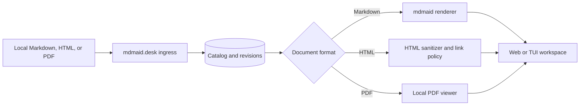

# Deferred proposal: registered HTML and PDF artifacts

Status: deferred idea for discussion. This document changes no runtime,
registration, rendering, or security behavior.

## Outcome

Let a user register a local `.html` or `.pdf` artifact in mdmaid.desk and read
it from the same persistent workspace used for Markdown. Keep document
identity, revisions, reading state, tags, attention, and review requests
independent of the file format.

This is about viewing existing artifacts. Exporting Markdown to HTML or PDF is
a separate rendering feature owned by `mdmaid`.

## What exists today

- Registration and managed import accept only `.md` files.
- The web API asks `mdmaid` for sanitized HTML or terminal text from Markdown.
- The browser has a print action and print stylesheet. A user can choose
  "Save as PDF" in the browser, but mdmaid.desk cannot register or read a PDF.
- Authenticated linked media is limited to validated local SVG files.
- `mdmaid` renders Markdown to HTML. Its CLI currently advertises
  `--format html, pdf`, but the render command does not branch on that option,
  so the flag is not evidence of working PDF generation.
- At the time of this proposal, `npm audit --omit=dev` reports
  `GHSA-g8qq-57p8-ggw5` against the installed `sanitize-html` 2.17.6. Enabling
  hostile HTML input is blocked until the dependency is updated to a fixed
  release and the sanitizer boundary is retested.

These are useful foundations, but none of them safely turns arbitrary HTML or
PDF bytes into a registered document.

## Product boundary

The proposed responsibility split is:



- `mdmaid.desk` owns format-aware ingress, durable identity, authorized byte
  access, viewer selection, and the web/TUI reading experience.
- `mdmaid` continues to own Markdown and Mermaid rendering primitives and any
  future Markdown-to-PDF export command.
- Producers select a file to register. They do not send trusted MIME types,
  executable HTML, browser options, or callback configuration.

## Proposed user experience

Keep the generic commands:

```bash
mdmaid-desk register reports/accessibility-audit.html --workspace app
mdmaid-desk register reports/release-notes.pdf --workspace app
mdmaid-desk import /tmp/agent-output/report.pdf --workspace app
```

The catalog records and returns a format badge: Markdown, HTML, or PDF. Stable
document URLs do not change. The reader selects the correct format adapter
after loading the document record.

For the first release:

- Markdown behaves exactly as it does now.
- HTML opens as sanitized document content inside the normal reader. Scripts,
  forms, embeds, frames, refresh directives, event handlers, and unauthorized
  subresources do not survive. This favors safe reading over pixel-perfect
  replay of an exported website.
- PDF opens in a bundled, same-origin PDF.js reader. Do not rely on browser
  plug-ins or an `<object>` exception in the main content security policy.
- The TUI shows sanitized structured text for HTML when conversion is reliable.
  For PDF, it shows metadata and an exact authenticated web-open action until
  a separately reviewed text extraction path exists. It must never print raw
  binary data.

HTML fidelity beyond the safe tag and style contract can be a later opt-in
sandbox mode. It should not be the default.

## Data and API changes

Add a discriminated document format such as:

```text
markdown  text/markdown
html      text/html
pdf       application/pdf
```

The format is derived and validated at ingress, then stored in the catalog. It
is not inferred again from a request header. This requires:

- a catalog migration that adds `format` to each document;
- a deterministic Markdown default for existing rows;
- binary-safe inspection and hashing for PDF files;
- managed snapshots that preserve the validated format and safe extension;
- public API output that includes format without exposing private paths;
- a render response discriminated between inline sanitized content and an
  authenticated PDF resource URL;
- watcher filters and reconciliation for each accepted extension.

Document IDs should continue to represent a workspace and canonical path.
Changing a file from one accepted format to another increments its revision
and makes pending review requests stale, just like any other content change.

## HTML security contract

Treat registered HTML as hostile input, including HTML generated by an agent.

- Resolve the current `sanitize-html` advisory before enabling the format. A
  passing dependency audit is part of the implementation gate, not optional
  cleanup after release.
- Require a regular, non-symlink, bounded UTF-8 file inside an authorized
  artifact root, or copy it through explicit managed import.
- Parse and sanitize with an allowlist. Never use direct `innerHTML` with raw
  source.
- Remove scripts, forms, frames, objects, embeds, SVG, `base`, meta refresh,
  inline event handlers, and dangerous URL schemes.
- Drop active inline styles initially. Reintroduce a reviewed style allowlist
  only when a real document needs it.
- Rewrite local links through existing opaque source or document routes after
  the same path authorization checks used for Markdown.
- Block remote images and styles by default. A document may link to a remote
  page, but opening that link remains an explicit browser navigation.
- Keep the main reader CSP, `nosniff`, no-store behavior, and authenticated
  loopback origin.

Do not describe this mode as a general local website host. It is a sanitized
document viewer.

## PDF security contract

PDF is binary, complex, and capable of carrying actions and attachments. Treat
the parser and viewer as a security boundary.

- Require a regular, non-symlink, bounded file in an authorized root and check
  both the `.pdf` extension and PDF signature before cataloging it.
- Serve bytes only from an authenticated document-scoped route with
  `application/pdf`, `nosniff`, same-origin resource policy, and no-store.
- Support bounded range requests only if the selected viewer requires them.
  Revalidate the real path, containment, identity, and size for every read.
- Bundle PDF.js locally and pin it through the normal dependency review and
  update process. Do not load a CDN viewer.
- Disable PDF JavaScript, automatic actions, embedded files, and silent
  external navigation. External links require a visible user action.
- Keep PDF bytes out of JSON render responses, logs, terminal output, and the
  SQLite catalog.

The PDF route is a document route, not an expansion of the SVG media route.
Their validation and content security policies remain separate.

## Delivery plan

1. Add format types, the catalog migration, byte-safe ingress, and tests while
   keeping Markdown as the only enabled format.
2. Enable sanitized HTML registration and import, then test path, revision,
   link, CSP, sanitizer, size, and managed-storage boundaries.
3. Add the authenticated PDF byte route and locally bundled viewer. Test
   signatures, range bounds, stale-file races, headers, actions, and errors.
4. Add format badges, browser navigation, TUI fallbacks, accessibility, print,
   and reading-progress behavior.
5. Enable `.html` and `.pdf` watcher discovery only after explicit registration
   and import behavior is proven.

Each phase should use tests first and keep `npm run check` green. Browser
verification is required for HTML sanitization, PDF navigation, keyboard use,
screen-reader labels, and print behavior.

## Acceptance evidence

- A Markdown, HTML, and PDF file can each be registered and imported without
  weakening artifact-root or managed-storage checks.
- The three formats preserve stable document IDs, revisions, reading state,
  tags, attention, and review-request binding.
- Hostile HTML cannot execute code, submit a form, frame content, refresh the
  page, or load an unauthorized local or remote subresource.
- A malformed, oversized, symlinked, moved, or replaced PDF is refused before
  bytes are served.
- The PDF viewer works without a network connection and does not execute PDF
  actions or attachments.
- The TUI never emits raw HTML control data or PDF bytes and always provides a
  usable next action for web-only content.
- Existing Markdown behavior and current SVG media handling remain unchanged.

## Separate export follow-up

If the desired feature is instead "save this Markdown explanation as HTML or
PDF," implement and verify that contract in `mdmaid` first. HTML export should
be self-contained or state its asset requirements. PDF export should wait for
Mermaid rendering and fonts, use deterministic page settings where practical,
and return a real failure when the optional browser renderer is unavailable.

Once that exists, mdmaid.desk may add explicit export actions. It should not
pretend that browser print, an advertised but unused CLI flag, and registered
PDF viewing are the same capability.

## Decisions still needed

- Is sanitized HTML sufficient for the first use cases, or is a separate
  high-fidelity sandbox mode required?
- Is a bundled PDF.js dependency acceptable, or should the first PDF release
  open an authenticated browser-native route only?
- What maximum sizes should apply to HTML and PDF independently?
- Should watcher discovery include the new formats at launch, or should they
  remain explicit-only until operational use proves the boundaries?
- Which PDF metadata, if any, is safe and useful to expose in the catalog?

Until those decisions are reviewed, this feature remains deferred and this
document is the implementation boundary, not approval to ship it.
