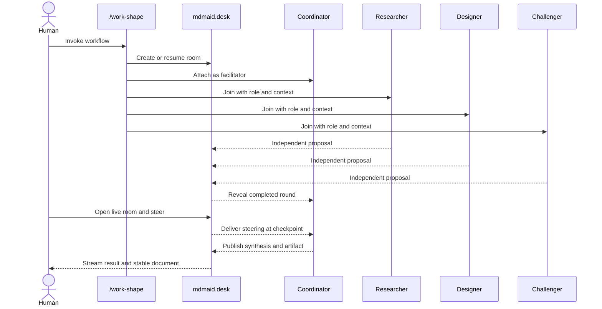
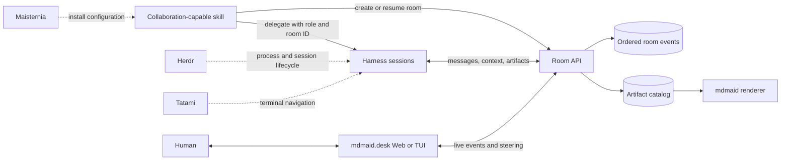

# Live Human-Agent Collaboration Rooms

Status: product shape; not implemented

## Summary

Expand `mdmaid.desk` from a persistent document inbox into the local desk where
humans and agent harnesses can work together. Documents remain first-class, but
they become artifacts inside a broader collaboration model that also includes
live rooms, participants, roles, ordered turns, scoped context, messages,
sessions, and human steering.

The room is not created manually in the web UI. A collaboration-capable skill
creates or resumes it automatically when work starts. The agents continue
headlessly when nobody is watching. A human can open the existing web desk at
any time, observe the live room, and begin participating without restarting the
workflow.

This is a deliberate expansion of the current product boundary. It does not
move runtime state back into Maisternia. Maisternia remains the configurator
that installs skills, endpoints, adapters, and policies. `mdmaid.desk` becomes
the owner of live collaboration state.

## Why This Belongs At The Desk

`mdmaid.desk` should be understood as a shared work desk or meeting space, not
only as a document reader. In a real meeting room:

- people and agents arrive with roles;
- participants speak in an intentional order;
- shared context and presentations provide common ground;
- notes, plans, decisions, and reports are produced;
- a human can enter late, catch up, and steer the discussion;
- the room remains available after the live meeting ends.

Markdown documents and Mermaid diagrams remain natural meeting artifacts, so
the existing catalog, renderer, web workspace, TUI, authentication, SQLite
storage, and event stream are useful foundations rather than a separate
product.

Names such as `mdmaid-workstate` are too narrow for this scope. A separate
collaboration service may be justified later, but creating one now would
duplicate infrastructure that already exists in `mdmaid.desk` before the
product boundary has been tested.

## Product Promise

> A local-first desk where humans and heterogeneous agent harnesses can join a
> controlled, persistent, context-aware collaboration room and produce durable
> artifacts together.

The first proof should be a live `/work-shape` room involving a coordinator and
two or three different harness participants. The agents can research,
brainstorm, challenge, and synthesize in ordered rounds while a human watches
or intervenes through the browser.

## Goals

- Create or resume rooms automatically from collaboration-capable skills.
- Continue working when no human has opened the desk.
- Let a human join an active room at any point and see its current ground.
- Deliver human comments and steering into the live workflow safely.
- Support participants from different harnesses without hard-coding providers
  into the collaboration domain.
- Assign explicit participant roles and deterministic turn or round policies.
- Preserve an ordered, durable account of visible collaboration events.
- Give each participant a scoped, versioned context view instead of copying
  every transcript everywhere.
- Attach documents, presentations, plans, reviews, diffs, and other outputs to
  the room as artifacts.
- Preserve the current local-first security and path-authorization posture.
- Degrade gracefully when the desk daemon or live integration is unavailable.

## Non-Goals

- Capturing private model reasoning or complete harness transcripts by default.
- Treating every installed skill as a collaboration workflow.
- Building a global autonomous-agent network in the first release.
- Replacing provider-native agent execution, permissions, or approvals.
- Replacing Herdr process/session lifecycle or Tatami terminal navigation.
- Letting a room message silently authorize commits, pushes, deployments, or
  other external actions.
- Making remote multi-user hosting a requirement for the local-first vertical
  slice.
- Recreating the rigid phase-state machine currently embedded in Maisternia.

## Primary Experience

### Automatic room creation

A skill declares that it supports collaboration. When invoked, it:

1. derives an idempotency key from the workflow run;
2. creates or resumes a room through the generic `mdmaid.desk` interface;
3. joins the current harness session as coordinator or facilitator;
4. publishes the room goal, constraints, and initial context snapshot;
5. spawns or delegates participants through configured harness runners;
6. passes each participant the room ID, role, capability token, and context
   revision;
7. begins the workflow without waiting for a browser client.

The skill may print a small receipt with the room ID and stable web route, but
the human is not required to open it.

Room creation must be automatic, cheap, idempotent, and non-blocking. It must
not reproduce a sequence of per-event shell approvals. Installation and trust
are handled separately; routine room events use the already authorized local
service.

`automatic` describes the interaction after a collaboration feature is
enabled. It does not mean current skills should depend on an unimplemented
service. Until this feature is ready, existing skills should run locally
without shared runtime state.

### Headless work and late human arrival

Agents continue even if the room has no connected human client. The daemon
stores ordered room events and streams them to connected clients. When a human
opens the desk, the room view reconstructs:

- the goal and current stage;
- participant identities, roles, and presence;
- the current context revision and pinned ground;
- visible messages and tool/status events;
- current turn ownership and waiting conditions;
- linked artifacts and their revisions;
- unresolved questions and requested human decisions.

Joining the room does not restart or pause it. Observation and participation
are separate choices.

### Live human steering

The web and TUI clients should expose explicit steering semantics rather than
treating every input as an undifferentiated chat message:

| Action | Intended behavior |
| --- | --- |
| Comment | Add visible context for subsequent turns. |
| Steer next | Deliver an instruction at the next safe workflow checkpoint. |
| Ask participant | Address a question to one role or participant. |
| Decide | Resolve a question that explicitly requires human judgment. |
| Pause | Request that the coordinator stop scheduling new turns. |
| Resume | Continue scheduling after a pause. |
| Stop | End the room run and preserve its current artifacts and history. |
| Interrupt | Request urgent delivery through a harness adapter that supports safe interruption. |

The coordinator acknowledges which steering event it consumed and at which
context revision. External authority remains enforced by the harness. A human
message in `mdmaid.desk` is input to the workflow, not a universal approval
token.

## Example: Multi-Harness Shape Room

The initial showcase should use a controlled round structure:

1. The user invokes `/work-shape` with an incomplete product idea.
2. The skill automatically creates a room and becomes facilitator.
3. It starts or delegates three participants with roles such as:
   - researcher;
   - divergent product designer;
   - adversarial challenger.
4. Round one is independent. Responses are withheld from the other
   participants until all have answered, reducing early anchoring.
5. The room reveals the proposals in a deterministic order.
6. Round two asks participants to critique specific proposals.
7. A synthesizer produces a recommendation with disagreements preserved.
8. The human may steer, ask a participant, request another round, or decide.
9. The final shape document is validated by `mdmaid`, registered as a room
   artifact, and remains available after all harness sessions exit.



## Domain Model

The collaboration model should extend the catalog through explicit entities
rather than placing room state in document metadata.

### Workspace

The existing project and filesystem authorization boundary. A room belongs to
one workspace. Cross-workspace artifacts require explicit authorization.

### Room

A durable collaboration around one goal or workflow run.

Suggested state:

```text
live -> waiting -> paused -> completed
  |         |         |          |
  +-------> failed ---+-------> abandoned
```

Completion records a workflow outcome; it does not imply approval of every
artifact or external action.

### Participant

A stable identity in a room. Participant kinds should be open and
provider-neutral:

```text
human | agent | coordinator | service
```

Provider and model names are opaque metadata. The room domain should not need a
release to recognize another harness.

### Session

One live or resumable connection for a participant. A participant may return
through another session. Session metadata can link to Herdr or another runner
without making `mdmaid.desk` the process owner.

### Role assignment

A versioned description of why a participant is present and what it should
produce. Roles can change between rounds without changing participant
identity.

### Round and turn

Ordered collaboration controls. Initial policies should be deterministic:

- coordinator-only;
- round robin;
- parallel then reveal;
- assigned sequence;
- human checkpoint.

Model-selected next speakers can be explored later after deterministic
policies are observable and testable.

### Message and event

An append-only visible contribution or state change. The daemon assigns a
monotonic room sequence so clients agree on what happened and in what order.
Every producer supplies an idempotency key to make reconnect and retry safe.

Representative event kinds:

```text
room.created
participant.joined
participant.presence_changed
context.published
round.started
turn.started
message.posted
steering.requested
steering.consumed
artifact.attached
room.paused
room.completed
room.failed
```

### Context snapshot

A versioned, scoped view of the room ground supplied to one or more
participants. It may include:

- goal, constraints, and acceptance criteria;
- assigned role and current turn contract;
- pinned facts, decisions, and open questions;
- selected room messages;
- relevant artifact links or excerpts;
- time, turn, cost, and authority limits.

It should not automatically contain full harness histories, secrets, or hidden
reasoning. A participant response records the context revision it consumed.

### Artifact

A durable output linked to the room and optionally to a message, turn, or
decision. Markdown documents continue through the existing secure catalog and
`mdmaid` renderer. Other artifact kinds can initially use metadata plus an
authorized link without broadening filesystem access.

## System Boundary



Ownership is intentionally split:

| Component | Owns |
| --- | --- |
| `mdmaid.desk` | Rooms, participants, presence, visible events, context snapshots, steering, and artifact relationships. |
| `mdmaid` | Markdown and Mermaid validation and rendering. |
| Skills | Workflow roles, turn policy, context-selection policy, checkpoints, and completion conditions. |
| Harnesses | Model execution, native sessions, tool use, and external-action approvals. |
| Herdr | Local and remote process/session persistence. |
| Tatami | Terminal and workspace discovery, navigation, and observation. |
| Maisternia | Installation and configuration of skills, adapters, MCPs, permissions, and policy. |

`mdmaid.desk` may later request that a configured launcher add a participant,
for example when a human clicks **Add agent**. The launcher remains a generic
extension boundary; the desk does not embed provider-specific credentials or
process management.

## Integration Surfaces

### Versioned room API

Representative endpoints, subject to schema design:

```text
POST   /api/v1/rooms
GET    /api/v1/rooms?status=&workspace=
GET    /api/v1/rooms/:id
POST   /api/v1/rooms/:id/participants
POST   /api/v1/rooms/:id/events
POST   /api/v1/rooms/:id/messages
POST   /api/v1/rooms/:id/steering
POST   /api/v1/rooms/:id/artifacts
POST   /api/v1/rooms/:id/pause
POST   /api/v1/rooms/:id/resume
POST   /api/v1/rooms/:id/complete
GET    /api/v1/rooms/:id/events
```

The existing daemon event stream can carry room-scoped updates. WebSocket or a
bidirectional streaming transport may be added only where SSE plus normal HTTP
actions is insufficient.

### MCP

An MCP server is a natural generic harness integration for room resources and
tools:

```text
rooms/list
rooms/read
context/read
messages/post
steering/read
artifacts/attach
turns/complete
```

MCP is an access surface, not the owner of collaboration semantics or durable
state. The daemon remains the source of truth.

### Agent-to-agent interoperability

The room model should avoid conflicting with the Agent2Agent Protocol's task,
message, artifact, and streaming concepts. A2A compatibility can later expose
independent agent applications without making it a prerequisite for Codex,
Claude, Hermes, or local CLI adapters.

References:

- [A2A Protocol overview](https://a2a-protocol.org/latest/)
- [MCP architecture](https://modelcontextprotocol.io/specification/2025-06-18/architecture)
- [AutoGen selector group chat](https://microsoft.github.io/autogen/stable/user-guide/agentchat-user-guide/selector-group-chat.html)

## Skill Contract

When collaboration support exists, participating skills can declare metadata
such as:

```yaml
collaboration:
  room: auto
  workflow: shape
  roles:
    - researcher
    - designer
    - challenger
    - synthesizer
  turn_policy: parallel_then_reveal
  human_checkpoints:
    - after_reveal
    - before_finalize
  artifacts:
    - shape
    - decision
    - plan
  fallback: local
```

This metadata describes how a skill uses the desk; it does not give
Maisternia runtime ownership. Maisternia may install the skill and its generic
desk integration.

Every delegated participant packet should contain only the minimum required
collaboration data:

```text
room ID
participant/session identity
assigned role
turn contract
context snapshot URI and revision
room capability token
budget and authority envelope
```

## Availability And Degraded Operation

Collaboration must not make an otherwise valid skill fragile.

- If the daemon is healthy, room mutations use its authenticated API and appear
  live immediately.
- If live collaboration is enabled but the daemon is temporarily unavailable,
  the skill continues locally and reports degraded observability once.
- A bounded local event spool may support later reconciliation, but replay must
  remain ordered and idempotent.
- Automatic room creation must never install a login service silently.
- Users who want an always-available desk explicitly enable the existing user
  service once; skills then reuse it.
- Failure to publish an observation event must not silently convert a
  read-only workflow into an external write or broaden authority.

## Security And Privacy

Live agent rooms create a larger trust boundary than document presentation.
The implementation must preserve or strengthen the existing local security
model.

- Keep the first release loopback-only and single-user.
- Issue scoped participant/session capabilities instead of sharing the daemon's
  full administrative token with every harness.
- Authorize room access by workspace and capability on every request.
- Treat agent and human messages as untrusted content, never executable policy.
- Do not collect raw chain-of-thought or full terminal transcripts by default.
- Require explicit selection before attaching repository files or context.
- Bound message, event, context, and artifact sizes.
- Apply rate, turn, time, and cost limits to autonomous collaboration.
- Record the visible event author, sequence, and consumed context revision.
- Keep external-action approval in the harness that performs the action.
- Preserve secure deletion and retention controls before adding remote or
  multi-user access.

## Web Workspace Shape

The default desk gains a **Live rooms** area alongside its document queue.

A room page should show:

- title, goal, workspace, state, and elapsed time;
- participant cards with role, harness metadata, and presence;
- current round, active turn, and waiting reason;
- a chronological visible timeline;
- pinned ground and context revision;
- unresolved questions and requested decisions;
- linked documents and other artifacts;
- steering composer and scoped room controls.

Document routes remain stable. Opening an artifact from a room uses the same
reader and revision model that exists today. Returning to the room preserves
timeline position and live subscriptions.

Humans are first-class participants in the schema from the beginning, even if
v1 supports only one local user. Multi-human collaboration can later reuse the
same room, participant, message, and steering concepts with stronger identity
and authorization.

## Implementation Sequence

### 0. Restore the current boundary

Before this feature is available, remove the mandatory shared-state dependency
from current Maisternia-installed skills. Existing workflows do not need to
create Maisternia tasks, classify sources, or perform runtime phase transitions
to function.

That cleanup belongs in a separate Maisternia PR. It should:

- make current `/work-*` skills conversation-local by default;
- remove or deprecate mandatory `maisternia pipeline`, `source`, and `grill`
  runtime calls;
- preserve declarative preset and workflow definitions;
- decide how to export, retain, or remove existing
  `~/.agent-workflow/tasks` data before deleting runtime code;
- keep future collaboration integration out until `mdmaid.desk` can support it.

### 1. Room and event foundation

- define strict runtime schemas;
- add SQLite migrations for rooms, participants, sessions, events, context
  snapshots, steering, and artifact links;
- add monotonic room sequencing and idempotency keys;
- add scoped room capability tokens;
- test restart, retry, malformed input, authorization, and concurrent writes.

### 2. Automatic single-session room

- add generic CLI/API/MCP creation and resume operations;
- let one experimental skill automatically create a room;
- attach the current coordinator session;
- publish goal, presence, progress, visible messages, and an artifact;
- preserve local fallback when the daemon is absent.

### 3. Live room workspace

- list active and recent rooms;
- render participant presence and the ordered timeline;
- stream updates without disturbing document subscriptions;
- add pinned ground, open questions, and artifact navigation;
- maintain web/TUI capability parity where practical.

### 4. Human steering

- add comment, steer-next, direct-question, pause, resume, stop, and interrupt
  request types;
- define coordinator acknowledgement and safe-checkpoint behavior;
- test late join, reconnect, duplicate delivery, and unsupported interruption;
- clearly distinguish workflow input from external-action approval.

### 5. Multi-harness collaboration

- propagate room identity and scoped capabilities through delegated packets;
- add deterministic role and turn policies;
- implement parallel-then-reveal brainstorming;
- integrate generic configured launchers without provider credentials in the
  desk;
- preserve disagreements and participant attribution during synthesis.

### 6. Remote and multi-human evolution

- evaluate remote transport and identity separately from the loopback trust
  model;
- link remote Herdr sessions without duplicating their lifecycle;
- add multiple human identities, invitations, and room-level permissions;
- add explicit retention, export, and deletion behavior.

## First Vertical-Slice Acceptance Criteria

The first collaboration slice is useful when:

1. an enabled `/work-shape` integration creates a room without manual web setup;
2. work proceeds when no human client is connected;
3. opening the stable room route reconstructs current participants, ground,
   events, and artifacts;
4. a human can submit a steer-next message and see which coordinator turn
   consumed it;
5. two or more heterogeneous harness participants can complete an ordered
   brainstorm, critique, and synthesis sequence;
6. the final Markdown artifact is validated, registered, and linked to the
   room;
7. daemon restart and participant reconnect do not duplicate visible events;
8. an unavailable desk degrades to local workflow execution without blocking;
9. no full transcript, hidden reasoning, filesystem path, or secret is exposed
   through the public room projection;
10. room participation grants no implicit commit, push, deploy, or approval
    authority.

## Open Questions

- Which coordinator mechanism receives steering most reliably across Codex,
  Claude, Hermes, and other harnesses: subscription, polling, hooks, or runner
  injection?
- Should the first integration attach an already-running participant before it
  supports spawning new ones?
- Which visible tool and progress events provide useful presence without
  becoming noisy telemetry?
- What retention default should apply to room messages and context snapshots?
- How should room URLs and capabilities work for remote Herdr sessions while
  preserving the local-first security model?
- Which collaboration policies belong in skill metadata, and which should be
  server-enforced safety limits?

These questions should be resolved against a working single-room vertical
slice rather than by expanding a generic workflow state machine in advance.
