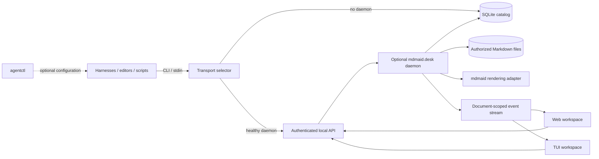

# mdmaid.desk Web and TUI Workspace Implementation Plan

## Goal

Build `mdmaid.desk` as a persistent local document inbox and reading workspace
with two equal first-class clients:

- a high-fidelity browser workspace;
- a fully terminal-native interactive TUI.

Documents can be produced by Claude, Codex, Agy, Hermes, Neovim, scripts, CI,
or any other harness/tool that can use the generic CLI/API or write into an
authorized artifact root.

## Product boundary

```text
mdmaid
  Markdown/Mermaid rendering primitives for web and terminal targets

mdmaid.desk
  Persistent catalog, optional daemon, revisions, reading queue, tags,
  watcher, stable document routes, web workspace, TUI workspace, CLI/API

mdmaid.nvim
  Neovim-specific client behavior

agentctl
  Configuration only

harnesses and tools
  Generic document producers
```

`mdmaid.desk` remains a separate product/package that depends on `mdmaid`.
It must not be collapsed into a `mdmaid show` subcommand. Rendering policy
belongs to `mdmaid`; persistent document and reading state belongs to
`mdmaid.desk`.

Opening or marking a document as read never grants workflow approval.

## Dependency order

Terminal rendering must land in `mdmaid` before the terminal document pane is
implemented here. See
[mdmaid PR #4](https://github.com/OleksandrBesan/mdmaid/pull/4).

Status: landed upstream.

The expected renderer order is:

1. Veol `--plain` when the optional binary is available.
2. `beautiful-mermaid` as the in-process Mermaid fallback.
3. Preserved Mermaid source with a warning when rendering is unsupported.

`mdmaid` should expose content-based library functions and structured results,
not require `mdmaid.desk` to invoke an interactive nested TUI.

Minimum terminal result contract:

```ts
interface TerminalRenderResult {
  output: string;
  plainText: string;
  toc: Array<{ id: string; text: string; level: number; line: number }>;
  links: Array<{ text: string; target: string; line: number }>;
  backend: "veol" | "beautiful-mermaid" | "source";
  warnings: string[];
}
```

## Shared architecture



The SQLite catalog is durable independently of a daemon. A short-lived producer
command can always add to the queue: it uses the authenticated API when a
healthy daemon is discoverable and otherwise opens the catalog for one bounded
transaction. Web, TUI, and future Neovim clients use the API for presentation
and reading actions.

While active, one optional daemon owns continuous behavior: filesystem
watching, live events, HTTP routes, and future comment/edit coordination. CLI
commands must prefer its API so mutations reach the daemon event stream. A
daemon is never started permanently as a side effect of document ingress.

## Document ingress

Support three producer-neutral paths:

1. Register an existing durable Markdown path.
2. Enqueue Markdown through stdin/API into a user-only managed inbox file.
3. Discover Markdown written beneath configured artifact roots.

Representative commands:

```bash
mdmaid-desk enqueue ./plan.md \
  --workspace my-project \
  --producer codex \
  --kind plan \
  --tag architecture

some-harness-command | mdmaid-desk enqueue - \
  --workspace my-project \
  --producer hermes \
  --title "Review report"
```

`producer` is opaque metadata, not a closed enum. Adding a harness must not
require a `mdmaid.desk` release.

Registration and enqueue must succeed after installation even if the user has
never started the web workspace, TUI, or background daemon. The next web/TUI
session reads the same catalog and displays all queued documents.

## Reading lifecycle

Reading state is separate from kind, attention, filesystem availability, and
external approval.

```text
Unread  -> current content revision has not been opened
Reading -> current revision rendered and was successfully shown
Done    -> user explicitly marked the current revision as read
```

Store progress against the content revision:

```text
revision
contentHash
openedRevision
completedRevision
```

Derive the visible state:

1. `completedRevision == revision` -> Done.
2. Else `openedRevision == revision` -> Reading.
3. Otherwise -> Unread.

New content increments the revision and returns the document to Unread.
Metadata-only changes do not reset progress. Opening is recorded only after a
client successfully paints the rendered document. Clearing completed items
archives catalog entries; it does not delete source Markdown.

## Grouping and filters

- Workspace is the first-class project and filesystem authorization boundary.
- Task ID is optional producer context within a workspace.
- Tags are flexible cross-project labels.
- Kind describes the artifact (`plan`, `review`, `decision`, and so on).
- Attention highlights why a document needs notice without granting approval.

The default queue shows Unread and Reading documents. Users can filter by
workspace/project, task, tag, status, kind, attention, missing state, or
archive state.

## Versioned local API

Representative endpoints:

```text
GET    /api/v1/health
GET    /api/v1/workspaces
POST   /api/v1/workspaces
GET    /api/v1/documents?workspace=&task=&tag=&status=&attention=
POST   /api/v1/documents
GET    /api/v1/documents/:id
POST   /api/v1/documents/:id/opened
POST   /api/v1/documents/:id/read
POST   /api/v1/documents/:id/unread
POST   /api/v1/documents/:id/archive
PUT    /api/v1/documents/:id/tags
GET    /api/v1/documents/:id/render?target=web
GET    /api/v1/documents/:id/render?target=terminal&width=100
GET    /api/v1/events
```

The daemon resolves and authorizes real paths, reads bounded Markdown content,
and passes content to `mdmaid`. Browser/TUI payloads must not expose absolute
filesystem paths.

Use normal HTTP requests for actions and Server-Sent Events for watcher and
catalog updates. Each document route/subscription is independent; there is no
server-global current file.

## Equal client capabilities

| Capability | Web workspace | TUI workspace |
|---|---|---|
| Queue | cards or list | scrollable list/table |
| Projects | tiles and project pages | project list/cards with counts |
| Filters | controls/chips | popup or command palette |
| Tags | chips/editor | popup/editor |
| Document | HTML and SVG Mermaid | terminal Markdown and Unicode/ASCII Mermaid |
| Status | badge and actions | status line and key actions |
| Search | search field | `/` or command palette |
| TOC | sidebar | side pane or popup |
| Archive | archive view | archive filter/action |
| Live updates | SSE refresh | SSE refresh preserving selection |

Capability parity does not require visually identical controls. Terminal
project lists with counts are equivalent to browser tiles.

## Web workspace

Carry forward the current mdmaid visual language:

- monospace presentation and Departure Mono;
- light/dark themes;
- document and table-of-contents sidebar;
- Vim-style scrolling and quick jumps;
- Mermaid/image zoom;
- responsive and print-friendly layout.

Add the persistent product shell: queue, project tiles, filters, tags, current
reading state, explicit Mark read, recent/updated sections, archive, and stable
document routes.

Bundle scripts, fonts, and styles locally. Use sanitized output, a restrictive
Content Security Policy, and a strict Mermaid security profile.

## TUI workspace

`mdmaid-desk tui` launches the interactive workspace. It is not merely a
stdout renderer.

Suggested queue layout:

```text
┌ Projects/Filters ─┬ Document queue ─────────────────────┐
│ all          12   │ ● unread  Plan: daemon lifecycle    │
│ mdmaid        4   │ ◐ reading TUI architecture          │
│ mdmaid.desk   8   │ ✓ done    Storage decision          │
├───────────────────┴─────────────────────────────────────┤
│ / search  Enter open  m mark read  u unread  a archive │
└─────────────────────────────────────────────────────────┘
```

Opening a document switches to a full reader or wide document pane with
scrolling, search, TOC, link navigation, tags, status actions, and back
navigation. The outer `mdmaid.desk` TUI owns the terminal screen; any Veol
integration uses non-interactive `--plain` output.

Initial commands:

```bash
mdmaid-desk web
mdmaid-desk tui
mdmaid-desk open <document> --viewer web
mdmaid-desk open <document> --viewer tui
mdmaid-desk list --json
mdmaid-desk enqueue <file|->
```

Do not make ingestion auto-open a viewer. Explicit `open --viewer auto` may be
added later after web and TUI behavior is stable.

## Implementation sequence

### 1. mdmaid terminal dependency

- land tested terminal rendering primitives in `mdmaid`;
- preserve existing HTML/browser behavior;
- make Veol optional and source fallback mandatory.

### 2. Shared domain and storage

Status: complete.

- add tests for revision-derived Unread/Reading/Done;
- introduce a storage interface and SQLite migrations;
- migrate the current JSON catalog transactionally;
- add tags, filters, archive, and missing state.

### 3. Daemon and API

Status: versioned API, daemon-first writes, single-instance background
lifecycle, and explicit user-service installation complete. Enqueue and watcher
work remain.

- route CLI mutations through a healthy daemon, with a direct-catalog fallback;
- implement single-instance start/status/stop;
- add explicit user-service install/uninstall without automatic installation;
- bind to loopback with authenticated local access;
- add generic registration/enqueue and versioned endpoints;
- add document-scoped events and render endpoints;
- test startup races, stale descriptors, SQLite contention, and live event
  delivery.

### 4. Web workspace

Status: initial queue/reader vertical slice complete.

- build queue/project/filter views;
- add safe stable document rendering;
- port mdmaid visual interactions;
- add browser end-to-end tests.

### 5. TUI workspace

Status: initial queue/reader vertical slice complete using published `mdmaid`
terminal rendering.

- select a terminal framework through a resize/ANSI/SSE/testability spike;
- build queue/project/filter navigation;
- integrate mdmaid terminal rendering;
- add status/tag/archive actions and live updates.

### 6. Clients and parity

Status: in progress. Web, TUI, and generic CLI mutations share the daemon API,
discovery descriptor, reading actions, filters, and live catalog events.
Neovim migration remains.

- keep CLI automation attach-first with a daemonless fallback;
- keep `web` attached to an existing daemon instead of starting a second service;
- migrate `mdmaid.nvim` to public daemon/rendering interfaces;
- run shared contract scenarios against web and TUI actions.

## Deferred extensions

Comments should later reference document ID and content revision, with heading
or line/context anchors that can become visibly stale. Editing should use
revision hashes/ETags, path re-authorization, and atomic file writes. Git or
the owning workspace remains responsible for long-term source history.

## Acceptance criteria

- Any harness/tool can enqueue or register Markdown without an agentctl runtime
  or running daemon.
- One optional user daemon serves multiple projects and live clients.
- Starting or stopping the daemon does not change the persistent queue.
- A running daemon receives CLI mutations through its API and publishes live
  catalog events.
- Permanent background service installation is an explicit user choice.
- Project grouping, tags, filters, and the default reading queue persist.
- Opening a successfully rendered revision marks Reading.
- Only an explicit action marks the current revision Done.
- Changed content becomes Unread again.
- Web and TUI support the same queue-reading workflow.
- Every document has a stable route and independent live updates.
- Terminal rendering works over SSH/tmux without browser or image protocols.
- Unsupported terminal diagrams preserve their source.
- The daemon cannot read outside authorized artifact roots.
- Registration or reading never grants workflow approval.
- `npm run check` and client-specific integration tests pass.
